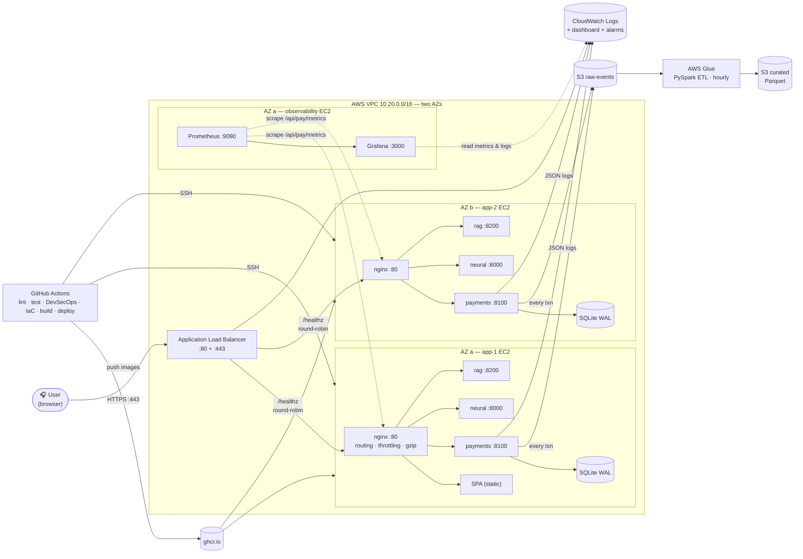

# Architecture

> Companion: [`SYLLABUS_MAPPING.md`](./SYLLABUS_MAPPING.md) maps every
> syllabus topic to the file that implements it.

## 1. High-level picture

The browser hits an **Application Load Balancer** which fans out across
**two app EC2 instances in two AZs**. A separate **observability EC2**
runs Prometheus and Grafana, scraping the app instances and pulling
CloudWatch metrics. Data eventually flows out to S3 and is reshaped by
AWS Glue (PySpark) into analytics-friendly Parquet.

## 2. Why microservices (not a monolith)

Three services were chosen for three different reasons that all matter
for the academic brief:

| Service | Why it's separate |
|---|---|
| **payments** | Highest correctness bar (double-entry ledger). Different release cadence and security profile from anything else; rate-limited harder; the **only** service that must never lose writes. |
| **neural** | Different runtime (TensorFlow + a different Python ABI), different resource shape (CPU-heavy, model files on disk), different scaling axis. Failure here degrades recommendations but must **not** break payments. |
| **rag** | Read-only retriever with no user state. Can be killed and restarted at any time. Used only by the help / "Ask Loopy" UI. |

The split lets each service own its own SLA, security group, container image
and release. The gateway papers over the split for the client — to the
browser there is one URL.

## 3. Service models in use

| AWS resource | Service model | Why this model |
|---|---|---|
| **EC2 t3.small** | IaaS | Need long-lived containers + websocket; cheapest path for a student project. |
| **S3** (3 buckets) | Storage-as-a-Service | Object durability + Glue compatibility, no servers. |
| **AWS Glue (crawler + job)** | Serverless / managed | Hourly batch ETL with auto-scaled DPUs — pay-per-run. |
| **CloudWatch Logs** | Managed observability | Single sink for app + nginx + Glue logs. |
| **IAM** | Identity / governance | Least-privilege roles for EC2 and Glue (no `*:*`). |

## 4. Data flow (one payment event, end to end)

1. User taps **Recharge** in the Loop Cards tab.
2. Frontend `LoopPay.req('/cards/<id>/recharge', 'POST', null, idempKey)`
   sends a JWT-authenticated POST through the gateway.
3. Gateway: rate-limit check → strip `/api/pay/` prefix → forward to
   `payments:8100/cards/<id>/recharge`.
4. Payments service:
   * Verifies JWT.
   * `ledger.recharge(card, user, idem)` runs inside a single SQLite
     transaction that writes **four** ledger legs:
     `-120 coins:user`, `+120 system:reserve`,
     `+60 minutes:card:<id>`, `-60 minutes:system:reserve`.
   * Net of every dimension across the four legs is zero — the trial
     balance invariant.
   * The same idempotency key returns the same response on retry.
5. Payments fires `archive_to_s3({…})` (best-effort, lazy boto3) →
   `s3://<raw>/payments/dt=YYYY-MM-DD/<txn>.json`.
6. Every hour the Glue crawler refreshes the catalog; the ETL job dedups
   on `txn_id`, derives `event_date` and writes partitioned Parquet to
   the curated zone.
7. CloudWatch ingests the JSON log line written by `JsonFormatter`.

## 5. Design decisions worth defending in a viva

* **Double-entry ledger over a balance column.** Auditability and
  invariant-by-construction. A simple balance column can drift; a ledger
  cannot — the trial balance check on `/health` proves it on every poll.
* **SQLite WAL, not RDS (yet).** Zero ops, fast, suitable for student-scale
  load. **In the current multi-instance deployment each app EC2 keeps its
  own SQLite file** — for a demo this gives genuine redundancy and the ALB
  load-balances across both. Moving payments to a real shared store (RDS
  PostgreSQL) is a one-DSN-env-var swap and is documented as the next
  hardening step in `RUNBOOK.md` §7.
* **ALB across two AZs, ASG-ready.** The current setup runs N=2 explicit
  app instances behind the ALB across `${region}a` and `${region}b`. Wrapping
  them in an Auto Scaling Group is a small Terraform change (`aws_launch_template`
  + `aws_autoscaling_group` referencing the existing target group).
* **Prometheus + Grafana on its own EC2.** Observability gets its own
  failure domain — if the app boxes burn down, the dashboard that tells
  you so is still up. The obs box scrapes the app instances directly
  (not through the public ALB) so metrics are per-instance.
* **CloudWatch as the long-term store; Grafana as the lens.** CloudWatch
  retains the data (alarms, log groups). Grafana is the "single pane of
  glass" your professor wants to see — one dashboard with Prometheus
  metrics + CloudWatch metrics + log group links side by side.
* **Local TF-IDF RAG, not Bedrock by default.** The project runs without
  any paid API key. Setting `LOOPY_LLM=bedrock` flips it on; the
  retriever interface already matches a vector-DB shape.
* **Path-based gateway, not port-based.** One public port (80/443) is
  enough — fewer security-group rules, cleaner TLS termination, easier
  to add caching or auth at the edge later.
* **Idempotency-Key on every mutating POST.** Required for safe retries
  in the face of network jitter — the failure mode payments must never
  produce is "transferred twice because the client retried".
* **JWT on a 60-minute expiry.** Matches the recharge horizon — a
  session naturally outlives one card's active pass.

## 6. What we deliberately didn't build

The syllabus is broad; not every topic warrants a production-grade
implementation in a semester project. These are explicit non-goals,
each with a defensible reason:

* **GraphQL.** REST is sufficient for the access patterns used here. The
  ledger's normalised endpoints (`/cards`, `/journal`) are GraphQL-ready
  if needed later.
* **Protobuf / gRPC.** JSON is easier to demo and the volumes are tiny.
  Protobuf would be the right call at >10k txns/sec.
* **mTLS between services.** The internal docker network already isolates
  service-to-service traffic. Adding mTLS would be busywork at this scale;
  the gateway is documented as the TLS-termination point.
* **Multi-cloud.** AWS is the primary target per the project brief.
  Azure and GCP equivalents (App Service / Cloud Run, ADLS / GCS, Data
  Factory / Dataflow) are noted but not provisioned.

## 7. How to extend

| If you want to… | Change |
|---|---|
| Scale payments horizontally | Move SQLite to RDS PostgreSQL; add `server payments-2:8100;` lines under `upstream payments_up`. |
| Use real LLM answers in RAG | Set `LOOPY_LLM=bedrock` and grant the EC2 role `bedrock:InvokeModel`. |
| Add a new microservice | Drop a new directory under `services/`, add a stanza to `docker-compose.yml`, add an `upstream` + `location /api/<name>/` block to nginx. |
| Move to multi-region | Replace single EC2 with an ASG behind an ALB; replicate the S3 raw bucket cross-region; Glue catalog replicates via crawler in each region. |
